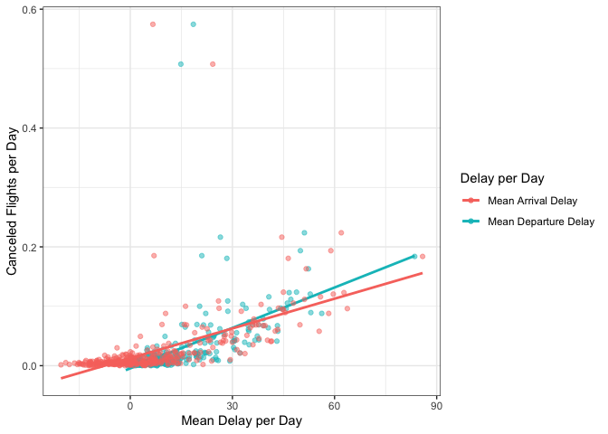

Week 3 Homework
================
Nalin Kim
2022-09-25

``` r
library(dplyr)
```

    ## Warning: package 'dplyr' was built under R version 4.1.2

    ## 
    ## Attaching package: 'dplyr'

    ## The following objects are masked from 'package:stats':
    ## 
    ##     filter, lag

    ## The following objects are masked from 'package:base':
    ## 
    ##     intersect, setdiff, setequal, union

``` r
library(tidyverse)
```

    ## ── Attaching packages ─────────────────────────────────────── tidyverse 1.3.1 ──

    ## ✓ ggplot2 3.3.5     ✓ purrr   0.3.4
    ## ✓ tibble  3.1.6     ✓ stringr 1.4.0
    ## ✓ tidyr   1.2.0     ✓ forcats 0.5.1
    ## ✓ readr   2.1.2

    ## Warning: package 'tidyr' was built under R version 4.1.2

    ## Warning: package 'readr' was built under R version 4.1.2

    ## ── Conflicts ────────────────────────────────────────── tidyverse_conflicts() ──
    ## x dplyr::filter() masks stats::filter()
    ## x dplyr::lag()    masks stats::lag()

``` r
library(ggplot2)
library(nycflights13)
theme_set(theme_bw())
```

#### 1.

How many flights have a missing dep_time? What other variables are
missing? What might these rows represent?

``` r
sum(is.na(flights$dep_time))
```

    ## [1] 8255

``` r
map_dbl(flights, ~ sum(is.na(.x)))
```

    ##           year          month            day       dep_time sched_dep_time 
    ##              0              0              0           8255              0 
    ##      dep_delay       arr_time sched_arr_time      arr_delay        carrier 
    ##           8255           8713              0           9430              0 
    ##         flight        tailnum         origin           dest       air_time 
    ##              0           2512              0              0           9430 
    ##       distance           hour         minute      time_hour 
    ##              0              0              0              0

There are 8255 flights with a missing `dep_time` variable, 8255 flights
with a missing `dep_delay` variable, 8713 flights with a missing
`arr_time` variable, 9430 with a missing `arr_delay` variable, and 9430
with a missing `air_time` variable. These missing variables represent
that there are flights that failed to depart, failed to arrive, and
canceled. On the other hand, it might be caused by possible data loss.

#### 2.

Currently dep_time and sched_dep_time are convenient to look at, but
hard to compute with because they’re not really continuous numbers.
Convert them to a more convenient representation of number of minutes
since midnight.

``` r
flights %>%
  mutate(dep_time = (dep_time %/% 100) * 60 + (dep_time %% 100),
       sched_dep_time = (sched_dep_time %/% 100) * 60 + (sched_dep_time %% 100))
```

    ## # A tibble: 336,776 × 19
    ##     year month   day dep_time sched_dep_time dep_delay arr_time sched_arr_time
    ##    <int> <int> <int>    <dbl>          <dbl>     <dbl>    <int>          <int>
    ##  1  2013     1     1      317            315         2      830            819
    ##  2  2013     1     1      333            329         4      850            830
    ##  3  2013     1     1      342            340         2      923            850
    ##  4  2013     1     1      344            345        -1     1004           1022
    ##  5  2013     1     1      354            360        -6      812            837
    ##  6  2013     1     1      354            358        -4      740            728
    ##  7  2013     1     1      355            360        -5      913            854
    ##  8  2013     1     1      357            360        -3      709            723
    ##  9  2013     1     1      357            360        -3      838            846
    ## 10  2013     1     1      358            360        -2      753            745
    ## # … with 336,766 more rows, and 11 more variables: arr_delay <dbl>,
    ## #   carrier <chr>, flight <int>, tailnum <chr>, origin <chr>, dest <chr>,
    ## #   air_time <dbl>, distance <dbl>, hour <dbl>, minute <dbl>, time_hour <dttm>

`%%` indicates x modulo y and `%/%` indicates integer division. The
arithmetic operators mutate `dep_time` and `sched_dep_time` from actual
times to number of minutes since midnight.

#### 3.

Look at the number of canceled flights per day. Is there a pattern? Is
the proportion of canceled flights related to the average delay? Use
multiple dyplr operations, all on one line, concluding with
ggplot(aes(x= ,y=)) + geom_point()

``` r
flights %>%
  group_by(year, month, day) %>%
  summarise(canceled = mean(is.na(dep_delay)),
            mean_dep_delay = mean(dep_delay, na.rm = T),
            mean_arr_delay = mean(arr_delay, na.rm = T)) %>%
  ggplot(aes(y = canceled)) +
  geom_point(aes(x =  mean_dep_delay, color = "Mean Departure Delay"), alpha = 0.5) +
  geom_smooth(aes(x =  mean_dep_delay, color = "Mean Departure Delay"), se = FALSE, method = "lm") + # regression line
  geom_point(aes(x = mean_arr_delay, color = "Mean Arrival Delay"), alpha = 0.5) +
  geom_smooth(aes(x = mean_arr_delay, color = "Mean Arrival Delay"), se = FALSE, method = "lm") + # regression line
  labs(x = "Mean Delay per Day", y = "Canceled Flights per Day", col = "Delay per Day")
```

    ## `summarise()` has grouped output by 'year', 'month'. You can override using the
    ## `.groups` argument.
    ## `geom_smooth()` using formula 'y ~ x'
    ## `geom_smooth()` using formula 'y ~ x'

<!-- -->

The linear regression line shows a weak positive relationship between
canceled flights and the average delay. In other words, there is a
higher proportion of canceled flights per day when there is more average
delay in minutes. It does not show a strong relationship, yet a few
notable points show a robust association between cancellation and delay.
